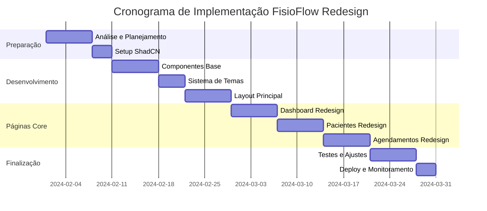
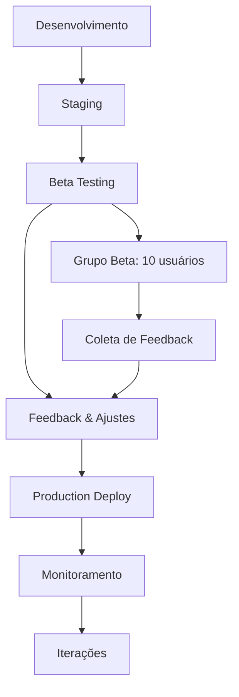

# FisioFlow - Roadmap de Implementação do Redesign UX/UI

## 1. Cronograma Executivo

### 1.1 Visão Geral do Projeto

**Duração Total**: 8-10 semanas\
**Equipe Necessária**: 2-3 desenvolvedores frontend, 1 designer UX/UI, 1 QA\
**Orçamento Estimado**: Médio-Alto\
**Impacto Esperado**: Alto (melhoria significativa na experiência do usuário)

### 1.2 Fases do Projeto



## 2. Especificações Detalhadas por Página

### 2.1 Dashboard - Redesign Completo

#### Wireframe Atual vs Novo

**Layout Atual (Problemas Identificados)**:

* Informações dispersas

* Falta de hierarquia visual

* Cards sem padronização

* Cores inconsistentes

**Novo Layout (ShadCN)**:

```
┌─────────────────────────────────────────────────────────────┐
│ Header: Logo + Navegação + Perfil + Notificações           │
├─────────────────────────────────────────────────────────────┤
│ Breadcrumb: Dashboard                                       │
├─────────────────────────────────────────────────────────────┤
│ Stats Cards Row (4 cards responsivos)                      │
│ ┌─────────┐ ┌─────────┐ ┌─────────┐ ┌─────────┐           │
│ │Pacientes│ │Consultas│ │Receita  │ │Satisf.  │           │
│ │   142   │ │   28    │ │R$ 8.5k  │ │  4.8★   │           │
│ │ +12%    │ │ +5%     │ │ +15%    │ │ +0.2    │           │
│ └─────────┘ └─────────┘ └─────────┘ └─────────┘           │
├─────────────────────────────────────────────────────────────┤
│ Content Grid (2 colunas em desktop, 1 em mobile)           │
│ ┌─────────────────────────┐ ┌─────────────────────────┐     │
│ │ Próximos Agendamentos   │ │ Gráfico de Performance  │     │
│ │ ┌─────────────────────┐ │ │ ┌─────────────────────┐ │     │
│ │ │ 09:00 - João Silva  │ │ │ │   Chart.js/Recharts │ │     │
│ │ │ 10:30 - Maria Costa │ │ │ │                     │ │     │
│ │ │ 14:00 - Pedro Lima  │ │ │ │                     │ │     │
│ │ └─────────────────────┘ │ │ └─────────────────────┘ │     │
│ └─────────────────────────┘ └─────────────────────────┘     │
│ ┌─────────────────────────┐ ┌─────────────────────────┐     │
│ │ Pacientes Recentes      │ │ Tarefas Pendentes       │     │
│ │ ┌─────────────────────┐ │ │ ┌─────────────────────┐ │     │
│ │ │ Lista com avatars   │ │ │ │ Checklist interativo│ │     │
│ │ │ e status            │ │ │ │ com prioridades     │ │     │
│ │ └─────────────────────┘ │ │ └─────────────────────┘ │     │
│ └─────────────────────────┘ └─────────────────────────┘     │
└─────────────────────────────────────────────────────────────┘
```

#### Componentes ShadCN Utilizados:

* `Card`, `CardHeader`, `CardContent`, `CardTitle`

* `Badge` para status e indicadores

* `Button` com variantes

* `Avatar`, `AvatarImage`, `AvatarFallback`

* `Progress` para métricas

* `Separator` para divisões

### 2.2 Lista de Pacientes - Redesign

#### Funcionalidades Aprimoradas:

**Filtros Avançados**:

```tsx
// Barra de filtros com ShadCN
<div className="flex flex-col sm:flex-row gap-4 mb-6">
  <div className="flex-1">
    <Input 
      placeholder="Buscar pacientes..." 
      icon={<Search />}
      className="w-full"
    />
  </div>
  <Select>
    <SelectTrigger className="w-[180px]">
      <SelectValue placeholder="Status" />
    </SelectTrigger>
    <SelectContent>
      <SelectItem value="active">Ativo</SelectItem>
      <SelectItem value="inactive">Inativo</SelectItem>
      <SelectItem value="pending">Pendente</SelectItem>
    </SelectContent>
  </Select>
  <Select>
    <SelectTrigger className="w-[180px]">
      <SelectValue placeholder="Especialidade" />
    </SelectTrigger>
  </Select>
  <Button variant="outline">
    <Filter className="h-4 w-4 mr-2" />
    Filtros
  </Button>
</div>
```

**Grid de Pacientes**:

```
┌─────────────────────────────────────────────────────────────┐
│ Filtros: [Busca] [Status] [Especialidade] [Mais Filtros]   │
├─────────────────────────────────────────────────────────────┤
│ Grid Responsivo (3 cols desktop, 2 tablet, 1 mobile)       │
│ ┌─────────────┐ ┌─────────────┐ ┌─────────────┐             │
│ │ 👤 João     │ │ 👤 Maria    │ │ 👤 Pedro    │             │
│ │ Silva       │ │ Costa       │ │ Lima        │             │
│ │ ────────────│ │ ────────────│ │ ────────────│             │
│ │ 45 anos     │ │ 32 anos     │ │ 58 anos     │             │
│ │ 📞 (11)9999 │ │ 📞 (11)8888 │ │ 📞 (11)7777 │             │
│ │ 📍 São Paulo│ │ 📍 Santos   │ │ 📍 Campinas │             │
│ │ ────────────│ │ ────────────│ │ ────────────│             │
│ │ 🟢 Ativo    │ │ 🟡 Pendente │ │ 🟢 Ativo    │             │
│ │ [Ver][Edit] │ │ [Ver][Edit] │ │ [Ver][Edit] │             │
│ └─────────────┘ └─────────────┘ └─────────────┘             │
└─────────────────────────────────────────────────────────────┘
```

### 2.3 Formulário de Paciente - Redesign

#### Layout Aprimorado:

```
┌─────────────────────────────────────────────────────────────┐
│ Header: Novo Paciente / Editar Paciente                    │
├─────────────────────────────────────────────────────────────┤
│ Tabs: [Dados Pessoais] [Histórico Médico] [Documentos]     │
├─────────────────────────────────────────────────────────────┤
│ Tab Content: Dados Pessoais                                 │
│ ┌─────────────────────────┐ ┌─────────────────────────┐     │
│ │ Foto do Paciente        │ │ Informações Básicas     │     │
│ │ ┌─────────────────────┐ │ │ ┌─────────────────────┐ │     │
│ │ │     📷 Upload      │ │ │ │ Nome Completo*      │ │     │
│ │ │     de Foto        │ │ │ │ [________________] │ │     │
│ │ └─────────────────────┘ │ │ │ Email*              │ │     │
│ └─────────────────────────┘ │ │ [________________] │ │     │
│                             │ │ Telefone*           │ │     │
│ ┌─────────────────────────┐ │ │ [________________] │ │     │
│ │ Endereço Completo       │ │ │ Data Nascimento*    │ │     │
│ │ ┌─────────────────────┐ │ │ │ [____/____/______] │ │     │
│ │ │ CEP: [_____-___]    │ │ │ └─────────────────────┘ │     │
│ │ │ Rua: [____________] │ │ └─────────────────────────┘     │
│ │ │ Nº: [___] Compl:[_] │ │                                 │
│ │ │ Bairro: [_________] │ │ ┌─────────────────────────┐     │
│ │ │ Cidade: [_________] │ │ │ Contato de Emergência   │     │
│ │ │ Estado: [__] ▼     │ │ │ ┌─────────────────────┐ │     │
│ │ └─────────────────────┘ │ │ │ Nome: [____________] │ │     │
│ └─────────────────────────┘ │ │ │ Tel: [_____________] │ │     │
│                             │ │ │ Parentesco: [_____] │ │     │
│ ┌─────────────────────────────────────────────────────────┐ │ │ └─────────────────────┘ │     │
│ │ Botões de Ação                                          │ │ └─────────────────────────┘     │
│ │ [Cancelar] [Salvar Rascunho] [Salvar e Continuar] ──── │ │                                 │
│ └─────────────────────────────────────────────────────────┘ │                                 │
└─────────────────────────────────────────────────────────────┘
```

#### Validação em Tempo Real:

```tsx
// Exemplo de campo com validação
<FormField
  control={form.control}
  name="email"
  render={({ field }) => (
    <FormItem>
      <FormLabel>Email *</FormLabel>
      <FormControl>
        <Input 
          placeholder="exemplo@email.com" 
          {...field}
          className={cn(
            "transition-colors",
            form.formState.errors.email && "border-destructive"
          )}
        />
      </FormControl>
      <FormDescription>
        Será usado para envio de lembretes e comunicações
      </FormDescription>
      <FormMessage />
    </FormItem>
  )}
/>
```

### 2.4 Calendário de Agendamentos - Redesign

#### Vista Mensal Aprimorada:

```
┌─────────────────────────────────────────────────────────────┐
│ Header: [← Anterior] Janeiro 2024 [Próximo →] [Hoje]       │
│ Filtros: [Todos] [Meus] [Fisioterapeuta ▼] [Status ▼]      │
├─────────────────────────────────────────────────────────────┤
│ Calendário                                                  │
│ ┌─────┬─────┬─────┬─────┬─────┬─────┬─────┐                 │
│ │ DOM │ SEG │ TER │ QUA │ QUI │ SEX │ SAB │                 │
│ ├─────┼─────┼─────┼─────┼─────┼─────┼─────┤                 │
│ │  31 │  1  │  2  │  3  │  4  │  5  │  6  │                 │
│ │     │ 🔵2 │ 🟢1 │ 🟡3 │ 🔵1 │ 🟢2 │     │                 │
│ ├─────┼─────┼─────┼─────┼─────┼─────┼─────┤                 │
│ │  7  │  8  │  9  │ 10  │ 11  │ 12  │ 13  │                 │
│ │ 🟢1 │ 🔵3 │ 🟡1 │ 🟢2 │ 🔵2 │ 🟢1 │     │                 │
│ └─────┴─────┴─────┴─────┴─────┴─────┴─────┘                 │
├─────────────────────────────────────────────────────────────┤
│ Legenda: 🔵 Consulta 🟢 Terapia 🟡 Avaliação 🔴 Cancelado   │
│ Sidebar: Próximos Agendamentos (lista detalhada)           │
└─────────────────────────────────────────────────────────────┘
```

#### Vista Diária Detalhada:

```
┌─────────────────────────────────────────────────────────────┐
│ Header: Terça-feira, 15 de Janeiro de 2024                 │
├─────────────────────────────────────────────────────────────┤
│ Timeline                                                    │
│ ┌─────┬─────────────────────────────────────────────────┐   │
│ │08:00│                                                 │   │
│ │     │ ┌─────────────────────────────────────────────┐ │   │
│ │09:00│ │ 👤 João Silva - Fisioterapia               │ │   │
│ │     │ │ 📍 Sala 1 | 📞 (11) 99999-9999            │ │   │
│ │     │ │ 📝 Sessão de reabilitação pós-cirúrgica    │ │   │
│ │     │ │ [Iniciar] [Reagendar] [Cancelar]           │ │   │
│ │     │ └─────────────────────────────────────────────┘ │   │
│ │10:00│                                                 │   │
│ │     │ ┌─────────────────────────────────────────────┐ │   │
│ │10:30│ │ 👤 Maria Costa - Avaliação                 │ │   │
│ │     │ │ 📍 Sala 2 | 📞 (11) 88888-8888            │ │   │
│ │     │ │ 📝 Primeira consulta - dor lombar          │ │   │
│ │     │ │ [Iniciar] [Reagendar] [Cancelar]           │ │   │
│ │     │ └─────────────────────────────────────────────┘ │   │
│ │11:00│                                                 │   │
│ └─────┴─────────────────────────────────────────────────┘   │
└─────────────────────────────────────────────────────────────┘
```

## 3. Especificações Técnicas de Implementação

### 3.1 Estrutura de Arquivos Reorganizada

```
src/
├── components/
│   ├── ui/                    # Componentes ShadCN base
│   │   ├── button.tsx
│   │   ├── card.tsx
│   │   ├── input.tsx
│   │   └── ...
│   ├── custom/               # Componentes customizados
│   │   ├── patient-card.tsx
│   │   ├── stats-card.tsx
│   │   ├── data-table.tsx
│   │   └── appointment-calendar.tsx
│   └── layout/               # Componentes de layout
│       ├── main-layout.tsx
│       ├── sidebar.tsx
│       ├── header.tsx
│       └── breadcrumb.tsx
├── pages/                    # Páginas redesenhadas
│   ├── Dashboard.tsx         # ✅ Redesign completo
│   ├── Patients.tsx          # ✅ Lista + filtros
│   ├── PatientForm.tsx       # ✅ Formulário multi-step
│   ├── Appointments.tsx      # ✅ Calendário aprimorado
│   └── Settings.tsx          # ✅ Configurações organizadas
├── hooks/                    # Hooks customizados
│   ├── use-theme.ts
│   ├── use-toast.ts
│   └── use-form-validation.ts
├── lib/                      # Utilitários
│   ├── utils.ts
│   ├── formatters.ts
│   ├── validators.ts
│   └── constants.ts
└── styles/
    ├── globals.css           # Variáveis CSS customizadas
    └── components.css        # Estilos específicos
```

### 3.2 Migração Gradual - Estratégia

#### Fase 1: Fundação (Semana 1-2)

```bash
# 1. Instalar ShadCN
npx shadcn-ui@latest init

# 2. Instalar componentes essenciais
npx shadcn-ui@latest add button card input select textarea
npx shadcn-ui@latest add tabs dialog sheet toast
npx shadcn-ui@latest add table calendar avatar badge

# 3. Configurar tema customizado
# Editar src/index.css com variáveis CSS

# 4. Criar componentes base customizados
# PatientCard, StatsCard, DataTable
```

#### Fase 2: Layout Principal (Semana 2-3)

```tsx
// 1. Redesenhar MainLayout
// 2. Implementar Sidebar responsiva
// 3. Criar Header com navegação
// 4. Adicionar Breadcrumb
// 5. Implementar sistema de temas
```

#### Fase 3: Páginas Core (Semana 3-6)

```tsx
// Semana 3: Dashboard
// - Stats cards com animações
// - Gráficos interativos
// - Lista de agendamentos
// - Tarefas pendentes

// Semana 4: Pacientes
// - Lista com filtros avançados
// - Cards responsivos
// - Busca em tempo real
// - Paginação

// Semana 5: Formulário de Paciente
// - Multi-step form
// - Validação em tempo real
// - Upload de foto
// - Auto-complete de endereço

// Semana 6: Agendamentos
// - Calendário interativo
// - Vista mensal/semanal/diária
// - Drag & drop para reagendar
// - Filtros por fisioterapeuta
```

#### Fase 4: Refinamentos (Semana 7-8)

```tsx
// 1. Testes de usabilidade
// 2. Ajustes de performance
// 3. Acessibilidade (WCAG)
// 4. Animações e micro-interações
// 5. Documentação
```

### 3.3 Checklist de Qualidade

#### Performance ✅

* [ ] Lazy loading de componentes

* [ ] Otimização de imagens

* [ ] Code splitting por rota

* [ ] Memoização de componentes pesados

* [ ] Debounce em buscas

#### Acessibilidade ✅

* [ ] Navegação por teclado

* [ ] Screen reader compatibility

* [ ] Contraste de cores (WCAG AA)

* [ ] Focus indicators visíveis

* [ ] Labels descritivos

#### Responsividade ✅

* [ ] Mobile-first approach

* [ ] Breakpoints consistentes

* [ ] Touch-friendly interactions

* [ ] Orientação landscape/portrait

* [ ] Testes em dispositivos reais

#### UX/UI ✅

* [ ] Feedback visual imediato

* [ ] Estados de loading

* [ ] Mensagens de erro claras

* [ ] Confirmações de ações

* [ ] Undo/Redo quando aplicável

## 4. Métricas de Sucesso

### 4.1 KPIs Técnicos

* **Performance**: Lighthouse Score > 90

* **Acessibilidade**: WCAG AA compliance

* **Bundle Size**: Redução de 20% no tamanho

* **Load Time**: < 3s em 3G

### 4.2 KPIs de Usuário

* **Task Completion Rate**: > 95%

* **Time on Task**: Redução de 30%

* **User Satisfaction**: Score > 4.5/5

* **Error Rate**: < 2%

### 4.3 Ferramentas de Monitoramento

```tsx
// Analytics de UX
- Google Analytics 4
- Hotjar (heatmaps)
- LogRocket (session replay)

// Performance
- Lighthouse CI
- Web Vitals
- Bundle Analyzer

// Acessibilidade
- axe-core
- WAVE
- Pa11y
```

## 5. Plano de Rollout

### 5.1 Estratégia de Deploy



### 5.2 Rollback Plan

```bash
# 1. Manter versão anterior em branch separada
git checkout -b backup/pre-redesign

# 2. Feature flags para componentes novos
const useNewDesign = process.env.REACT_APP_NEW_DESIGN === 'true'

# 3. Deploy gradual por percentual de usuários
# 10% -> 25% -> 50% -> 100%

# 4. Monitoramento de métricas em tempo real
# Se erro rate > 5%, rollback automático
```

### 5.3 Comunicação com Stakeholders

**Semana 1**: Kickoff meeting + apresentação do plano\
**Semana 3**: Demo da fundação + componentes base\
**Semana 5**: Demo das páginas principais\
**Semana 7**: Beta testing com usuários selecionados\
**Semana 8**: Go-live + treinamento da equipe

***

**Documento criado em**: Janeiro 2024\
**Versão**: 1.0\
**Status**: Aprovado para implementação\
**Próxima revisão**: Após conclusão da Fase 1

**Responsáveis**:

* **Tech Lead**: Implementação técnica

* **UX Designer**: Validação de usabilidade

* **Product Owner**: Aprovação de funcionalidades

* **QA Lead**: Testes e validação de qualidade

