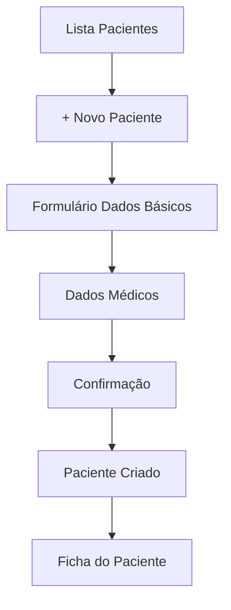
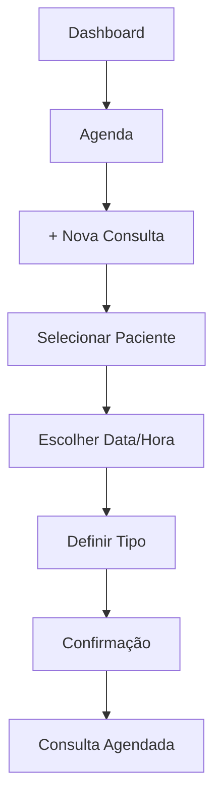

# FisioFlow - Guia Completo de Redesign UX/UI com ShadCN

## 1. Análise de Requisitos e Definição de Objetivos

### 1.1 Análise da Interface Atual

#### Pontos Fortes Identificados:

* ✅ Sistema de autenticação robusto com múltiplos perfis

* ✅ Dashboard funcional com métricas básicas

* ✅ Gestão completa de pacientes e consultas

* ✅ Integração eficiente com Supabase

* ✅ Responsividade básica implementada

#### Pontos de Melhoria Identificados:

* 🔄 **Consistência Visual**: Variações nos padrões de design entre páginas

* 🔄 **Hierarquia Visual**: Falta de clareza na organização de informações

* 🔄 **Acessibilidade**: Necessidade de melhorar contraste e navegação por teclado

* 🔄 **Microinterações**: Ausência de feedback visual em ações do usuário

* 🔄 **Design System**: Falta de padronização de componentes

* 🔄 **Performance Visual**: Otimização de carregamento e transições

### 1.2 Objetivos Específicos do Redesign

#### Objetivos Primários:

1. **Melhorar Usabilidade**: Reduzir tempo de execução de tarefas em 30%
2. **Aumentar Acessibilidade**: Atingir conformidade WCAG 2.1 AA
3. **Padronizar Interface**: Implementar design system consistente
4. **Otimizar Fluxos**: Simplificar jornadas críticas do usuário

#### Objetivos Secundários:

1. **Modernizar Visual**: Aplicar tendências de design contemporâneo
2. **Melhorar Performance**: Otimizar carregamento e responsividade
3. **Facilitar Manutenção**: Criar componentes reutilizáveis
4. **Aumentar Engajamento**: Implementar microinterações efetivas

### 1.3 Personas e Jornadas do Usuário

#### Persona 1: Dr. Carlos - Administrador da Clínica

**Perfil**: 45 anos, diretor clínico, foco em gestão e resultados
**Necessidades**:

* Dashboard executivo com KPIs claros

* Relatórios financeiros acessíveis

* Gestão eficiente de equipe e recursos

**Jornada Crítica**:

1. Login → Dashboard → Análise de métricas → Tomada de decisão
2. Gestão de usuários → Configurações → Relatórios

#### Persona 2: Dra. Ana - Fisioterapeuta

**Perfil**: 32 anos, especialista em reabilitação, foco no atendimento
**Necessidades**:

* Acesso rápido a informações de pacientes

* Registro eficiente de evolução

* Agendamento simplificado

**Jornada Crítica**:

1. Login → Lista de pacientes → Ficha do paciente → Registro de evolução
2. Agenda → Novo agendamento → Confirmação

#### Persona 3: Maria - Paciente

**Perfil**: 58 anos, aposentada, baixa familiaridade tecnológica
**Necessidades**:

* Interface simples e intuitiva

* Informações claras sobre tratamento

* Acesso fácil ao histórico

**Jornada Crítica**:

1. Login → Meus dados → Histórico de consultas
2. Agendamentos → Visualizar próximas consultas

## 2. Estratégia de Design

### 2.1 Princípios de Design

#### Princípios Fundamentais:

1. **Clareza**: Informações organizadas hierarquicamente
2. **Consistência**: Padrões visuais uniformes
3. **Eficiência**: Redução de cliques e tempo de execução
4. **Acessibilidade**: Design inclusivo para todos os usuários
5. **Confiabilidade**: Interface que transmite segurança e profissionalismo

#### Diretrizes de Interação:

* **Feedback Imediato**: Toda ação deve ter resposta visual

* **Prevenção de Erros**: Validações claras e mensagens orientativas

* **Flexibilidade**: Adaptação a diferentes níveis de experiência

* **Controle do Usuário**: Possibilidade de desfazer ações

### 2.2 Diretrizes de Acessibilidade (WCAG 2.1 AA)

#### Perceptível:

* Contraste mínimo de 4.5:1 para texto normal

* Contraste mínimo de 3:1 para texto grande

* Suporte a leitores de tela

* Legendas para conteúdo audiovisual

#### Operável:

* Navegação completa por teclado

* Tempo suficiente para leitura

* Ausência de conteúdo que cause convulsões

* Navegação consistente

#### Compreensível:

* Linguagem clara e objetiva

* Funcionalidade previsível

* Assistência na correção de erros

* Instruções claras

#### Robusto:

* Compatibilidade com tecnologias assistivas

* Código semântico válido

* Suporte a diferentes navegadores

### 2.3 Arquitetura da Informação Otimizada

#### Estrutura de Navegação Principal:

```
FisioFlow/
├── Dashboard (Visão Geral)
├── Pacientes/
│   ├── Lista de Pacientes
│   ├── Cadastro
│   └── Ficha Individual
├── Agendamentos/
│   ├── Calendário
│   ├── Novo Agendamento
│   └── Histórico
├── Exercícios/
│   ├── Biblioteca
│   ├── Prescrições
│   └── Progressão
├── Relatórios/
│   ├── Financeiro
│   ├── Clínico
│   └── Operacional
├── Configurações/
│   ├── Perfil
│   ├── Clínica
│   └── Sistema
└── Ajuda/
    ├── Tutoriais
    ├── FAQ
    └── Suporte
```

## 3. Design System com ShadCN

### 3.1 Paleta de Cores Atualizada

#### Cores Primárias:

```css
/* Azul Médico - Confiança e Profissionalismo */
--primary-50: #eff6ff
--primary-100: #dbeafe
--primary-500: #3b82f6  /* Cor principal */
--primary-600: #2563eb
--primary-900: #1e3a8a

/* Verde Saúde - Sucesso e Bem-estar */
--success-50: #f0fdf4
--success-100: #dcfce7
--success-500: #22c55e
--success-600: #16a34a
--success-900: #14532d

/* Laranja Atenção - Alertas e Avisos */
--warning-50: #fffbeb
--warning-100: #fef3c7
--warning-500: #f59e0b
--warning-600: #d97706
--warning-900: #92400e

/* Vermelho Crítico - Erros e Urgências */
--error-50: #fef2f2
--error-100: #fee2e2
--error-500: #ef4444
--error-600: #dc2626
--error-900: #7f1d1d
```

#### Cores Neutras:

```css
/* Escala de Cinzas */
--gray-50: #f9fafb
--gray-100: #f3f4f6
--gray-200: #e5e7eb
--gray-300: #d1d5db
--gray-400: #9ca3af
--gray-500: #6b7280
--gray-600: #4b5563
--gray-700: #374151
--gray-800: #1f2937
--gray-900: #111827
```

### 3.2 Tipografia e Hierarquia Visual

#### Família Tipográfica:

```css
/* Fonte Principal - Inter (Sans-serif moderna) */
--font-family-primary: 'Inter', -apple-system, BlinkMacSystemFont, 'Segoe UI', sans-serif;

/* Fonte Secundária - JetBrains Mono (Monospace para códigos) */
--font-family-mono: 'JetBrains Mono', 'Fira Code', monospace;
```

#### Escala Tipográfica:

```css
/* Títulos */
--text-xs: 0.75rem;    /* 12px */
--text-sm: 0.875rem;   /* 14px */
--text-base: 1rem;     /* 16px */
--text-lg: 1.125rem;   /* 18px */
--text-xl: 1.25rem;    /* 20px */
--text-2xl: 1.5rem;    /* 24px */
--text-3xl: 1.875rem;  /* 30px */
--text-4xl: 2.25rem;   /* 36px */

/* Pesos */
--font-light: 300;
--font-normal: 400;
--font-medium: 500;
--font-semibold: 600;
--font-bold: 700;
```

### 3.3 Componentes ShadCN Utilizados

#### Componentes Base:

* **Button**: Ações primárias e secundárias

* **Input**: Campos de entrada de dados

* **Select**: Seleção de opções

* **Textarea**: Campos de texto longo

* **Checkbox**: Seleções múltiplas

* **Radio**: Seleções exclusivas

* **Switch**: Alternadores binários

#### Componentes de Layout:

* **Card**: Containers de conteúdo

* **Sheet**: Painéis laterais

* **Dialog**: Modais e confirmações

* **Tabs**: Navegação por abas

* **Accordion**: Conteúdo expansível

#### Componentes de Navegação:

* **Breadcrumb**: Navegação hierárquica

* **Pagination**: Navegação de páginas

* **Command**: Busca e comandos

* **Navigation Menu**: Menu principal

#### Componentes de Feedback:

* **Alert**: Mensagens de sistema

* **Toast**: Notificações temporárias

* **Progress**: Indicadores de progresso

* **Skeleton**: Estados de carregamento

* **Badge**: Indicadores de status

### 3.4 Tokens de Design

#### Espaçamento:

```css
--spacing-0: 0;
--spacing-1: 0.25rem;  /* 4px */
--spacing-2: 0.5rem;   /* 8px */
--spacing-3: 0.75rem;  /* 12px */
--spacing-4: 1rem;     /* 16px */
--spacing-6: 1.5rem;   /* 24px */
--spacing-8: 2rem;     /* 32px */
--spacing-12: 3rem;    /* 48px */
--spacing-16: 4rem;    /* 64px */
```

#### Sombras:

```css
--shadow-sm: 0 1px 2px 0 rgb(0 0 0 / 0.05);
--shadow-md: 0 4px 6px -1px rgb(0 0 0 / 0.1);
--shadow-lg: 0 10px 15px -3px rgb(0 0 0 / 0.1);
--shadow-xl: 0 20px 25px -5px rgb(0 0 0 / 0.1);
```

#### Bordas:

```css
--border-radius-sm: 0.25rem;  /* 4px */
--border-radius-md: 0.375rem; /* 6px */
--border-radius-lg: 0.5rem;   /* 8px */
--border-radius-xl: 0.75rem;  /* 12px */
```

## 4. Wireframes e Protótipos

### 4.1 Estrutura de Wireframes - Dashboard

```
┌─────────────────────────────────────────────────────────────┐
│ [Logo] FisioFlow                    [Notif] [Avatar] [Menu] │
├─────────────────────────────────────────────────────────────┤
│ Dashboard > Visão Geral                                     │
├─────────────────────────────────────────────────────────────┤
│ ┌─────────────┐ ┌─────────────┐ ┌─────────────┐ ┌─────────┐ │
│ │   Pacientes │ │   Consultas │ │  Receita    │ │ Satisf. │ │
│ │     156     │ │     23      │ │  R$ 12.5k   │ │  4.8★   │ │
│ │   +12 mês   │ │   hoje      │ │   +15%      │ │  +0.2   │ │
│ └─────────────┘ └─────────────┘ └─────────────┘ └─────────┘ │
├─────────────────────────────────────────────────────────────┤
│ ┌─────────────────────────┐ ┌─────────────────────────────┐ │
│ │    Agenda do Dia        │ │     Pacientes Recentes      │ │
│ │                         │ │                             │ │
│ │ 09:00 - João Silva      │ │ • Maria Santos - Fisio      │ │
│ │ 10:30 - Ana Costa       │ │ • Pedro Lima - Ortopedia    │ │
│ │ 14:00 - Carlos Mendes   │ │ • Julia Rocha - Neurologia  │ │
│ │                         │ │                             │ │
│ └─────────────────────────┘ └─────────────────────────────┘ │
└─────────────────────────────────────────────────────────────┘
```

### 4.2 Estrutura de Wireframes - Lista de Pacientes

```
┌─────────────────────────────────────────────────────────────┐
│ [Logo] FisioFlow                    [Notif] [Avatar] [Menu] │
├─────────────────────────────────────────────────────────────┤
│ Pacientes > Lista                                           │
├─────────────────────────────────────────────────────────────┤
│ [🔍 Buscar paciente...] [Filtros ▼] [+ Novo Paciente]      │
├─────────────────────────────────────────────────────────────┤
│ ┌─────────────────────────────────────────────────────────┐ │
│ │ [📷] João Silva          │ Idade: 45  │ [Ver] [Editar] │ │
│ │      Fisioterapia        │ Tel: (11)  │                │ │
│ │      Última: 15/01/2024  │ 99999-9999 │                │ │
│ ├─────────────────────────────────────────────────────────┤ │
│ │ [📷] Maria Santos        │ Idade: 32  │ [Ver] [Editar] │ │
│ │      Ortopedia           │ Tel: (11)  │                │ │
│ │      Última: 14/01/2024  │ 88888-8888 │                │ │
│ └─────────────────────────────────────────────────────────┘ │
│                                          [← 1 2 3 4 5 →]   │
└─────────────────────────────────────────────────────────────┘
```

### 4.3 Fluxos de Navegação Otimizados

#### Fluxo 1: Cadastro de Novo Paciente



#### Fluxo 2: Agendamento de Consulta



### 4.4 Especificações de Responsividade

#### Breakpoints:

* **Mobile**: 320px - 767px

* **Tablet**: 768px - 1023px

* **Desktop**: 1024px - 1439px

* **Large Desktop**: 1440px+

#### Adaptações por Dispositivo:

**Mobile (320px - 767px)**:

* Menu hambúrguer

* Cards em coluna única

* Tabelas com scroll horizontal

* Botões de ação flutuantes

**Tablet (768px - 1023px)**:

* Menu lateral colapsível

* Cards em 2 colunas

* Navegação por abas

* Modais em tela cheia

**Desktop (1024px+)**:

* Menu lateral fixo

* Layout em grid completo

* Hover states ativos

* Tooltips informativos

## 5. Plano de Implementação

### 5.1 Fases de Desenvolvimento

#### Fase 1: Fundação (Semanas 1-2)

**Objetivos**: Estabelecer base do design system
**Entregas**:

* [ ] Configuração do ShadCN no projeto

* [ ] Implementação de tokens de design

* [ ] Criação de componentes base customizados

* [ ] Configuração de temas (claro/escuro)

**Componentes Prioritários**:

* Button, Input, Select, Card

* Layout base e navegação

* Sistema de cores e tipografia

#### Fase 2: Páginas Principais (Semanas 3-4)

**Objetivos**: Redesign das páginas mais utilizadas
**Entregas**:

* [ ] Dashboard redesenhado

* [ ] Lista de pacientes otimizada

* [ ] Ficha do paciente melhorada

* [ ] Sistema de navegação unificado

#### Fase 3: Funcionalidades Avançadas (Semanas 5-6)

**Objetivos**: Implementar recursos específicos
**Entregas**:

* [ ] Agenda interativa

* [ ] Sistema de relatórios

* [ ] Configurações avançadas

* [ ] Módulo de exercícios

#### Fase 4: Refinamentos e Testes (Semanas 7-8)

**Objetivos**: Polimento e validação
**Entregas**:

* [ ] Testes de usabilidade

* [ ] Correções de acessibilidade

* [ ] Otimizações de performance

* [ ] Documentação final

### 5.2 Cronograma de Execução

```
Semana 1-2: Fundação
├── Dia 1-3: Setup ShadCN e tokens
├── Dia 4-7: Componentes base
├── Dia 8-10: Sistema de temas
└── Dia 11-14: Testes iniciais

Semana 3-4: Páginas Principais
├── Dia 15-18: Dashboard
├── Dia 19-22: Lista pacientes
├── Dia 23-26: Ficha paciente
└── Dia 27-28: Navegação

Semana 5-6: Funcionalidades
├── Dia 29-32: Agenda
├── Dia 33-36: Relatórios
├── Dia 37-40: Configurações
└── Dia 41-42: Exercícios

Semana 7-8: Refinamentos
├── Dia 43-46: Testes usabilidade
├── Dia 47-50: Acessibilidade
├── Dia 51-54: Performance
└── Dia 55-56: Documentação
```

### 5.3 Testes de Usabilidade Planejados

#### Teste 1: Navegação e Descoberta (Semana 4)

**Objetivos**: Validar fluxos de navegação
**Participantes**: 5 usuários por perfil (Admin, Fisio, Paciente)
**Tarefas**:

1. Encontrar informações de um paciente específico
2. Agendar uma nova consulta
3. Gerar relatório mensal

**Métricas**:

* Tempo de conclusão da tarefa

* Taxa de sucesso

* Número de cliques

* Satisfação (escala 1-10)

#### Teste 2: Funcionalidades Específicas (Semana 6)

**Objetivos**: Validar recursos implementados
**Participantes**: 3 usuários por perfil
**Tarefas**:

1. Cadastrar novo paciente completo
2. Registrar evolução de tratamento
3. Configurar preferências do sistema

#### Teste 3: Acessibilidade (Semana 7)

**Objetivos**: Validar conformidade WCAG
**Participantes**: Usuários com deficiências visuais
**Ferramentas**:

* Leitores de tela (NVDA, JAWS)

* Navegação apenas por teclado

* Teste de contraste automático

### 5.4 Métricas de Sucesso

#### Métricas Quantitativas:

* **Tempo de Tarefa**: Redução de 30% no tempo médio

* **Taxa de Erro**: Redução de 50% em erros de usuário

* **Satisfação**: Score mínimo de 4.5/5.0

* **Acessibilidade**: 100% conformidade WCAG 2.1 AA

* **Performance**: Lighthouse score > 90

#### Métricas Qualitativas:

* **Facilidade de Uso**: Feedback positivo em 90% dos casos

* **Clareza Visual**: Hierarquia compreendida por 95% dos usuários

* **Consistência**: Padrões reconhecidos em todas as páginas

* **Confiabilidade**: Interface transmite profissionalismo

### 5.5 Ferramentas e Recursos

#### Desenvolvimento:

* **ShadCN/UI**: Biblioteca de componentes

* **Tailwind CSS**: Framework de estilização

* **Radix UI**: Primitivos acessíveis

* **Lucide React**: Ícones consistentes

#### Design:

* **Figma**: Prototipação e design system

* **Stark**: Plugin de acessibilidade

* **Contrast**: Verificação de contraste

#### Testes:

* **Lighthouse**: Auditoria de performance

* **axe-core**: Testes de acessibilidade

* **React Testing Library**: Testes de componentes

* **Playwright**: Testes end-to-end

## 6. Considerações Finais

### 6.1 Benefícios Esperados

#### Para Usuários:

* Interface mais intuitiva e eficiente

* Redução no tempo de aprendizado

* Melhor experiência em dispositivos móveis

* Maior acessibilidade para todos os perfis

#### Para o Negócio:

* Redução em custos de suporte

* Maior satisfação do cliente

* Facilidade de manutenção e evolução

* Diferencial competitivo no mercado

#### Para Desenvolvimento:

* Código mais organizado e reutilizável

* Facilidade de implementação de novas features

* Melhor performance e SEO

* Redução de bugs relacionados à UI

### 6.2 Riscos e Mitigações

#### Riscos Identificados:

1. **Resistência à Mudança**: Usuários habituados à interface atual

   * *Mitigação*: Treinamento gradual e documentação clara

2. **Complexidade Técnica**: Migração de componentes existentes

   * *Mitigação*: Implementação incremental por fases

3. **Prazo Apertado**: Cronograma ambicioso

   * *Mitigação*: Priorização de funcionalidades críticas

4. **Compatibilidade**: Diferentes navegadores e dispositivos

   * *Mitigação*: Testes extensivos em múltiplas plataformas

### 6.3 Próximos Passos

1. **Aprovação do Plano**: Validação com stakeholders
2. **Setup do Ambiente**: Configuração de ferramentas
3. **Início da Fase 1**: Implementação dos fundamentos
   4

