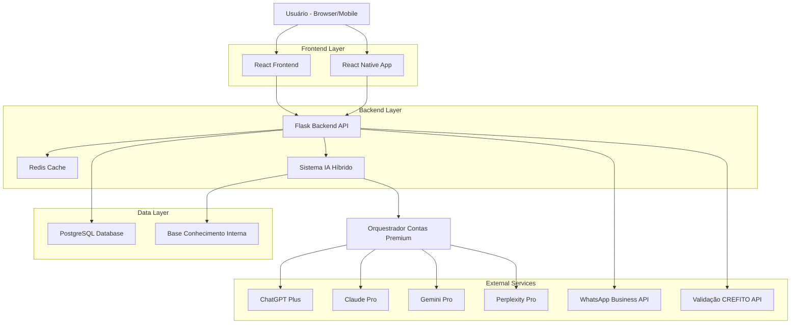
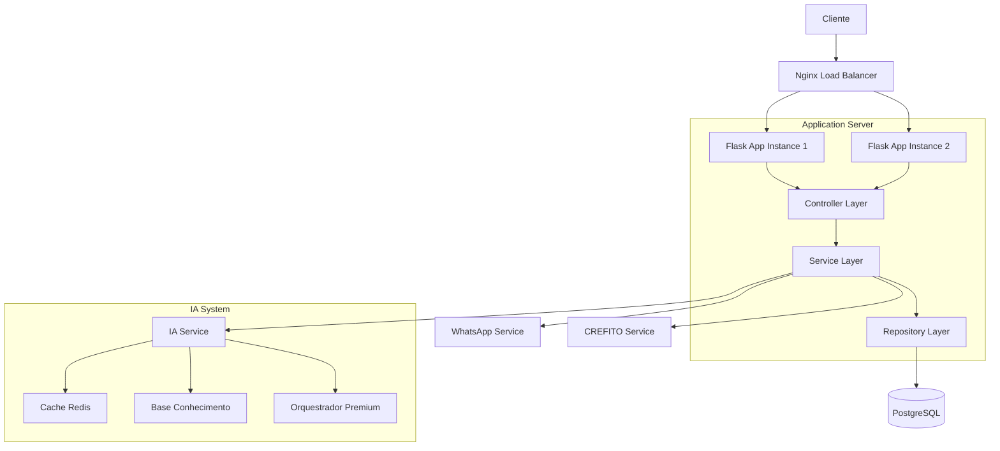
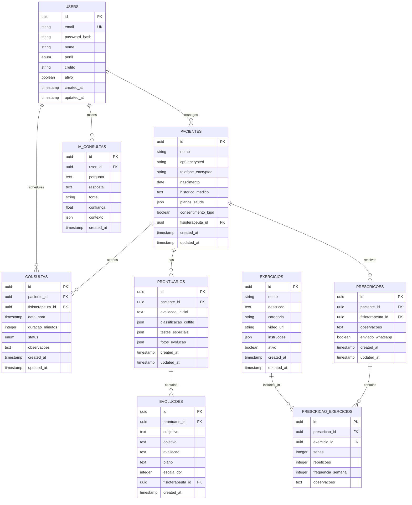

# FisioFlow - Documento de Arquitetura Técnica

## 1. Design da Arquitetura



## 2. Descrição das Tecnologias

* **Frontend**: React\@19 + TypeScript\@5.3 + Vite\@5.0 + TailwindCSS\@3.4 + React Query\@5.0

* **Mobile**: React Native\@0.73 + Expo SDK\@51 + TypeScript + React Navigation\@6

* **Backend**: Flask\@3.0 + SQLAlchemy\@2.0 + Flask-JWT-Extended\@4.6 + Celery\@5.3

* **Database**: PostgreSQL\@16 (produção) + SQLite\@3.45 (desenvolvimento)

* **Cache**: Redis\@7.2 + Redis-py\@5.0

* **IA**: Sistema híbrido personalizado + Selenium\@4.15 (automação contas premium)

## 3. Definições de Rotas

### Frontend (React)

| Rota           | Propósito                                        |
| -------------- | ------------------------------------------------ |
| /              | Dashboard principal baseado no perfil do usuário |
| /login         | Página de autenticação com 2FA                   |
| /pacientes     | Lista e gestão de pacientes                      |
| /pacientes/:id | Detalhes e prontuário do paciente                |
| /agenda        | Calendário multi-profissional                    |
| /exercicios    | Biblioteca de exercícios e prescrições           |
| /ia            | Interface do sistema de IA híbrido               |
| /financeiro    | Gestão financeira e relatórios                   |
| /configuracoes | Configurações do sistema e perfil                |

### Mobile (React Native)

| Rota        | Propósito                                   |
| ----------- | ------------------------------------------- |
| /home       | Dashboard do paciente com exercícios do dia |
| /exercicios | Player de exercícios com timer offline      |
| /evolucao   | Gráficos de evolução e registro de dor      |
| /agenda     | Agendamentos e histórico de consultas       |
| /chat       | Comunicação com fisioterapeuta              |
| /perfil     | Dados pessoais e configurações              |

## 4. Definições de API

### 4.1 APIs Principais

**Autenticação e Usuários**

```
POST /api/auth/login
```

Request:

| Parâmetro  | Tipo   | Obrigatório | Descrição                |
| ---------- | ------ | ----------- | ------------------------ |
| email      | string | true        | Email do usuário         |
| password   | string | true        | Senha (será hasheada)    |
| totp\_code | string | false       | Código 2FA se habilitado |

Response:

| Parâmetro      | Tipo   | Descrição               |
| -------------- | ------ | ----------------------- |
| access\_token  | string | JWT token de acesso     |
| refresh\_token | string | Token para renovação    |
| user           | object | Dados do usuário logado |
| permissions    | array  | Lista de permissões     |

**Gestão de Pacientes**

```
GET /api/pacientes
POST /api/pacientes
GET /api/pacientes/{id}
PUT /api/pacientes/{id}
DELETE /api/pacientes/{id}
```

**Prontuários Eletrônicos**

```
GET /api/pacientes/{id}/prontuario
POST /api/pacientes/{id}/evolucoes
GET /api/pacientes/{id}/evolucoes
```

**Sistema de Agendamento**

```
GET /api/agenda
POST /api/agenda/consultas
PUT /api/agenda/consultas/{id}
DELETE /api/agenda/consultas/{id}
```

**Biblioteca de Exercícios**

```
GET /api/exercicios
GET /api/exercicios/categorias
POST /api/prescricoes
GET /api/pacientes/{id}/prescricoes
```

**Sistema de IA Híbrido**

```
POST /api/ia/consulta
GET /api/ia/historico
POST /api/ia/base-conhecimento
```

Request para consulta IA:

| Parâmetro      | Tipo   | Obrigatório | Descrição                                    |
| -------------- | ------ | ----------- | -------------------------------------------- |
| pergunta       | string | true        | Pergunta clínica                             |
| contexto       | object | false       | Dados do paciente para contexto              |
| tipo\_consulta | string | true        | diagnóstico, exercicios, evolucao, relatorio |

Response:

| Parâmetro   | Tipo   | Descrição                                         |
| ----------- | ------ | ------------------------------------------------- |
| resposta    | string | Resposta da IA                                    |
| fonte       | string | Fonte da resposta (interna, chatgpt, claude, etc) |
| confianca   | number | Nível de confiança (0-1)                          |
| referencias | array  | Referências utilizadas                            |

## 5. Arquitetura do Servidor



## 6. Modelo de Dados

### 6.1 Definição do Modelo de Dados



### 6.2 Linguagem de Definição de Dados

**Tabela de Usuários**

```sql
-- Criar tabela de usuários
CREATE TABLE users (
    id UUID PRIMARY KEY DEFAULT gen_random_uuid(),
    email VARCHAR(255) UNIQUE NOT NULL,
    password_hash VARCHAR(255) NOT NULL,
    nome VARCHAR(100) NOT NULL,
    perfil VARCHAR(20) NOT NULL CHECK (perfil IN ('ADMIN', 'FISIOTERAPEUTA', 'ESTAGIARIO', 'PACIENTE', 'PARCEIRO')),
    crefito VARCHAR(20),
    ativo BOOLEAN DEFAULT true,
    created_at TIMESTAMP WITH TIME ZONE DEFAULT NOW(),
    updated_at TIMESTAMP WITH TIME ZONE DEFAULT NOW()
);

-- Criar índices
CREATE INDEX idx_users_email ON users(email);
CREATE INDEX idx_users_perfil ON users(perfil);
CREATE INDEX idx_users_ativo ON users(ativo);
```

**Tabela de Pacientes**

```sql
-- Criar tabela de pacientes
CREATE TABLE pacientes (
    id UUID PRIMARY KEY DEFAULT gen_random_uuid(),
    nome VARCHAR(100) NOT NULL,
    cpf_encrypted TEXT NOT NULL,
    telefone_encrypted TEXT,
    nascimento DATE,
    historico_medico TEXT,
    planos_saude JSONB,
    consentimento_lgpd BOOLEAN DEFAULT false,
    fisioterapeuta_id UUID REFERENCES users(id),
    created_at TIMESTAMP WITH TIME ZONE DEFAULT NOW(),
    updated_at TIMESTAMP WITH TIME ZONE DEFAULT NOW()
);

-- Criar índices
CREATE INDEX idx_pacientes_fisioterapeuta ON pacientes(fisioterapeuta_id);
CREATE INDEX idx_pacientes_nome ON pacientes(nome);
CREATE INDEX idx_pacientes_created_at ON pacientes(created_at DESC);
```

**Tabela de Exercícios**

```sql
-- Criar tabela de exercícios
CREATE TABLE exercicios (
    id UUID PRIMARY KEY DEFAULT gen_random_uuid(),
    nome VARCHAR(100) NOT NULL,
    descricao TEXT,
    categoria VARCHAR(50) NOT NULL CHECK (categoria IN ('Cervical', 'Membros Superiores', 'Tronco', 'Membros Inferiores', 'Mobilização Neural', 'Mobilidade Geral')),
    video_url VARCHAR(500),
    instrucoes JSONB,
    ativo BOOLEAN DEFAULT true,
    created_at TIMESTAMP WITH TIME ZONE DEFAULT NOW(),
    updated_at TIMESTAMP WITH TIME ZONE DEFAULT NOW()
);

-- Criar índices
CREATE INDEX idx_exercicios_categoria ON exercicios(categoria);
CREATE INDEX idx_exercicios_ativo ON exercicios(ativo);
CREATE INDEX idx_exercicios_nome ON exercicios(nome);
```

**Dados Iniciais**

```sql
-- Inserir usuário admin inicial
INSERT INTO users (email, password_hash, nome, perfil) VALUES 
('admin@fisioflow.com', '$2b$12$LQv3c1yqBWVHxkd0LHAkCOYz6TtxMQJqhN8/LewdBPj6hsxq5S/kS', 'Administrador', 'ADMIN');

-- Inserir exercícios básicos
INSERT INTO exercicios (nome, descricao, categoria, instrucoes) VALUES 
('Flexão Cervical', 'Movimento suave de flexão do pescoço', 'Cervical', '{"series": 3, "repeticoes": 10, "tempo_manutencao": 5}'),
('Elevação de Ombros', 'Elevação dos ombros em direção às orelhas', 'Membros Superiores', '{"series": 2, "repeticoes": 15, "resistencia": "sem_peso"}'),
('Ponte Glútea', 'Elevação do quadril em decúbito dorsal', 'Tronco', '{"series": 3, "repeticoes": 12, "tempo_manutencao": 3}');
```

