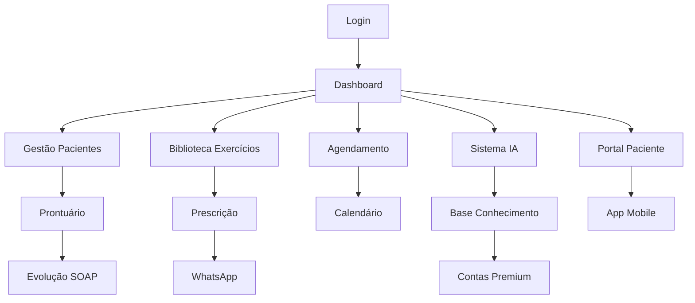

# FisioFlow - Documento de Requisitos de Produto (PRD)

## 1. Visão Geral do Produto

O FisioFlow é um sistema completo de gestão de clínica de fisioterapia, desenvolvido para uso exclusivo em clínicas privadas. O sistema oferece uma solução integrada mobile-first que conecta proprietários, fisioterapeutas, estagiários, pacientes e parceiros em uma plataforma moderna e eficiente.

O produto resolve os principais desafios de gestão clínica: agendamento inteligente, prontuários eletrônicos conformes ao COFFITO, prescrição de exercícios com IA, comunicação automatizada e gestão financeira integrada. O sistema visa otimizar a operação clínica e melhorar a experiência do paciente através de tecnologia avançada e conformidade regulatória.

## 2. Funcionalidades Principais

### 2.1 Perfis de Usuário

| Perfil | Método de Registro | Permissões Principais |
|--------|-------------------|----------------------|
| ADMIN | Configuração inicial do sistema | Acesso total, configurações, relatórios financeiros, gestão de usuários |
| FISIOTERAPEUTA | Convite do admin + validação CREFITO | Gestão de pacientes, prontuários, agendamentos, prescrições |
| ESTAGIARIO | Convite do fisioterapeuta supervisor | Acesso supervisionado a pacientes designados, prontuários limitados |
| PACIENTE | Auto-registro + validação clínica | Portal pessoal, agendamentos, exercícios, evolução |
| PARCEIRO | Convite do admin + contrato | Painel financeiro, vouchers, relatórios de atendimento |

### 2.2 Módulos Funcionais

Nosso sistema FisioFlow é composto pelos seguintes módulos principais:

1. **Dashboard Administrativo**: painel de controle, métricas de performance, gestão de usuários, configurações do sistema.
2. **Gestão de Pacientes**: cadastro completo, prontuários eletrônicos, histórico médico, documentos.
3. **Sistema de Agendamento**: calendário multi-profissional, recorrências, lista de espera, check-in digital.
4. **Biblioteca de Exercícios**: catálogo com vídeos, prescrições personalizadas, progressão automática.
5. **Sistema de IA Híbrido**: base de conhecimento, orquestrador de contas premium, cache inteligente.
6. **Portal do Paciente**: dashboard pessoal, exercícios, evolução, agendamentos online.
7. **App Mobile**: funcionalidade offline-first, player de exercícios, diário de dor, notificações.
8. **Sistema Financeiro**: faturamento, vouchers de parceiros, relatórios, integração bancária.

### 2.3 Detalhes das Páginas

| Nome da Página | Nome do Módulo | Descrição da Funcionalidade |
|----------------|----------------|-----------------------------|
| Dashboard Admin | Painel de Controle | Visualizar métricas em tempo real, KPIs da clínica, alertas do sistema, acesso rápido a funcionalidades críticas |
| Gestão de Pacientes | Cadastro e Prontuários | Criar/editar pacientes, gerenciar prontuários eletrônicos, upload de documentos, histórico médico completo |
| Calendário | Sistema de Agendamento | Visualizar agenda multi-profissional, criar/editar consultas, gerenciar recorrências, lista de espera |
| Biblioteca de Exercícios | Catálogo de Exercícios | Navegar exercícios por categoria, criar prescrições, gerenciar vídeos demonstrativos, sistema de favoritos |
| Portal IA | Sistema de Inteligência | Consultar base de conhecimento, fazer perguntas clínicas, gerar relatórios, análise de evolução |
| Portal do Paciente | Dashboard Pessoal | Visualizar tratamento, acessar exercícios prescritos, registrar dor/sintomas, agendar consultas |
| App Mobile | Aplicativo Nativo | Executar exercícios offline, sincronizar dados, receber notificações, autenticação biométrica |
| Sistema Financeiro | Gestão Financeira | Gerar faturas, gerenciar vouchers, relatórios financeiros, integração com bancos |

## 3. Processo Principal

### Fluxo do Fisioterapeuta:
1. Login com autenticação 2FA → Dashboard com agenda do dia
2. Atendimento: acessar prontuário → registrar evolução SOAP → prescrever exercícios
3. Prescrição: selecionar exercícios da biblioteca → personalizar séries/repetições → enviar via WhatsApp
4. Consulta IA: fazer pergunta clínica → sistema busca base interna → se necessário, consulta conta premium
5. Relatórios: gerar relatório de alta → análise de evolução com IA → exportar PDF

### Fluxo do Paciente:
1. Receber link de exercícios via WhatsApp → abrir no app mobile
2. Executar exercícios com timer → registrar dor/sintomas → sincronizar dados
3. Portal web: visualizar evolução → agendar próxima consulta → chat com fisioterapeuta
4. Notificações: lembretes de exercícios → confirmação de consultas → resultados de exames

## 4. Design da Interface do Usuário

### 4.1 Estilo de Design

- **Cores Primárias**: Azul médico (#2563EB), Verde saúde (#059669), Branco clínico (#FFFFFF)
- **Cores Secundárias**: Cinza neutro (#6B7280), Azul claro (#DBEAFE), Verde claro (#D1FAE5)
- **Estilo de Botões**: Rounded corners (8px), sombras sutis, estados hover/active bem definidos
- **Tipografia**: Inter (títulos), Open Sans (corpo), tamanhos 14px-24px, peso 400-600
- **Layout**: Design system baseado em cards, navegação top/sidebar, grid responsivo 12 colunas
- **Ícones**: Heroicons para consistência, ícones médicos personalizados, estilo outline/solid

### 4.2 Visão Geral do Design das Páginas

| Nome da Página | Nome do Módulo | Elementos da UI |
|----------------|----------------|----------------|
| Dashboard Admin | Painel Principal | Cards de métricas com gradientes, gráficos interativos Chart.js, sidebar colapsível, header com notificações |
| Gestão Pacientes | Lista/Formulário | Tabela com filtros avançados, modal de edição, upload drag-and-drop, timeline de histórico |
| Calendário | Visualização Agenda | Calendário FullCalendar.js, cores por profissional, modal de agendamento, drag-and-drop |
| Biblioteca Exercícios | Grid de Vídeos | Grid responsivo de cards, player de vídeo inline, tags de categoria, busca com filtros |
| Portal IA | Interface Chat | Chat interface estilo WhatsApp, loading states, histórico de consultas, botões de ação rápida |
| Portal Paciente | Dashboard Pessoal | Layout simplificado, cards grandes, gráficos de evolução, botões de ação primários |
| App Mobile | Interface Nativa | Bottom navigation, cards full-width, gestos touch, animações fluidas, modo escuro |

### 4.3 Responsividade

O sistema é mobile-first com adaptação progressiva para desktop. Otimizado para iOS (iPhone 12+) com suporte completo a gestos touch, autenticação biométrica e funcionalidade offline. Interface adaptativa que prioriza conteúdo essencial em telas menores e expande funcionalidades em desktop.