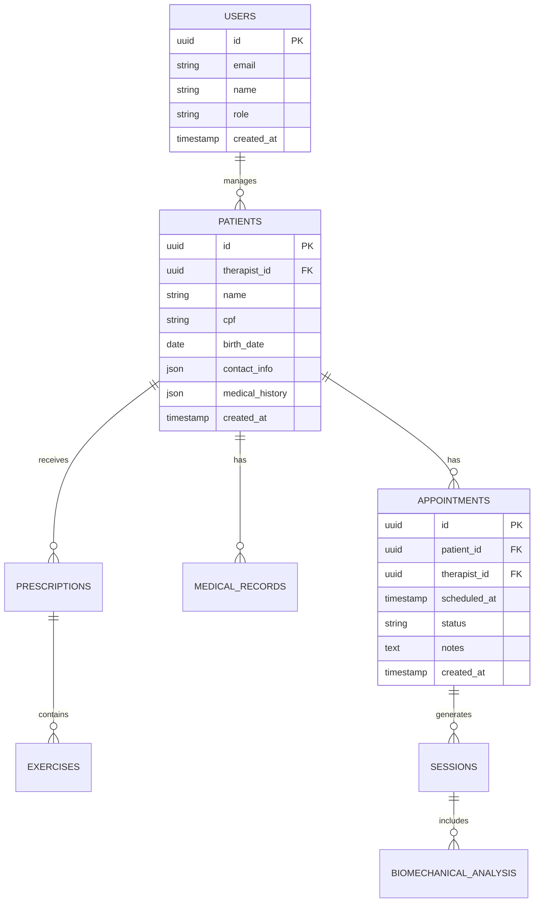

# FisioFlow - Roadmap de Desenvolvimento

## 1. Visão Geral do Projeto

O FisioFlow é uma plataforma completa de gestão para fisioterapeutas, integrando agendamentos, prontuários eletrônicos, prescrições de exercícios e análise biomecânica com IA. O projeto está atualmente deployado e funcional, mas requer melhorias críticas na integridade dos dados e expansão de funcionalidades.

## 2. Estado Atual

### ✅ Funcionalidades Implementadas
- Sistema de autenticação com Supabase
- Dashboard principal com métricas básicas
- Interface responsiva e moderna
- Deploy em produção na Vercel
- Conexão em tempo real funcional

### ⚠️ Problemas Identificados
- Uso de `field_X` em vez de nomes de campos no JSON
- Inconsistências entre schema SQL e dados JSON
- Duplicações na tabela de migrations
- Falta de validações robustas
- Inconsistências entre tipos TypeScript e implementação

## 3. Roadmap de Desenvolvimento

### 🔥 FASE 1: Correções Críticas (1-2 semanas)

#### Prioridade ALTA - Integridade de Dados

**Semana 1:**
1. **Normalização de Dados JSON**
   - Substituir `field_X` por nomes descritivos nos JSONs
   - Padronizar estrutura de dados de pacientes
   - Corrigir campos de exercícios e prescrições

2. **Limpeza de Migrations**
   - Remover duplicações na tabela migrations
   - Consolidar migrations conflitantes
   - Criar backup antes das alterações

**Semana 2:**
3. **Implementação de Validações**
   - Validação de entrada de dados no frontend
   - Validação de schema no backend
   - Tratamento de erros robusto

4. **Sincronização de Tipos TypeScript**
   - Atualizar interfaces TypeScript
   - Garantir consistência entre frontend e backend
   - Implementar type guards

### 🚀 FASE 2: Funcionalidades Core (3-4 semanas)

#### Módulo de Pacientes
**Semana 3:**
- Cadastro completo de pacientes
- Histórico médico detalhado
- Upload de documentos e exames
- Sistema de busca e filtros

**Semana 4:**
- Prontuário eletrônico completo
- Evolução do tratamento
- Anotações e observações
- Integração com agendamentos

#### Módulo de Agendamentos
**Semana 5:**
- Calendário interativo
- Agendamento online para pacientes
- Notificações automáticas
- Gestão de horários e disponibilidade

**Semana 6:**
- Confirmação de consultas
- Reagendamento automático
- Lista de espera
- Relatórios de ocupação

### 📈 FASE 3: Funcionalidades Avançadas (4-6 semanas)

#### Módulo de Exercícios e Prescrições
**Semanas 7-8:**
- Biblioteca de exercícios com vídeos
- Criação de protocolos personalizados
- Prescrição digital de exercícios
- Acompanhamento de aderência

#### Módulo de Análise Biomecânica com IA
**Semanas 9-10:**
- Upload e análise de vídeos
- Detecção de padrões de movimento
- Relatórios automáticos de análise
- Sugestões de correção

#### Sistema de Relatórios
**Semanas 11-12:**
- Relatórios de evolução do paciente
- Análises estatísticas da clínica
- Exportação em PDF
- Dashboard analítico avançado

### 🔮 FASE 4: Expansão e Escalabilidade (6+ semanas)

#### Funcionalidades Premium
**Semanas 13-15:**
- Telemedicina integrada
- App mobile para pacientes
- Integração com dispositivos IoT
- Sistema de pagamentos

#### Otimizações e Performance
**Semanas 16-18:**
- Cache inteligente
- Otimização de queries
- CDN para vídeos
- Monitoramento de performance

## 4. Especificações Técnicas

### 4.1 Arquitetura de Dados

### 4.2 Stack Tecnológico

**Frontend:**
- React 18 + TypeScript
- Tailwind CSS
- Vite
- React Query para cache
- React Hook Form para formulários

**Backend:**
- Supabase (PostgreSQL + Auth + Storage)
- Edge Functions para IA
- Webhooks para notificações

**Integrações:**
- OpenAI API para análise biomecânica
- SendGrid para emails
- Stripe para pagamentos (futuro)

## 5. Cronograma de Implementação

| Fase | Duração | Início | Fim | Entregáveis |
|------|---------|--------|-----|-------------|
| Fase 1 | 2 semanas | Semana 1 | Semana 2 | Dados íntegros, validações |
| Fase 2 | 4 semanas | Semana 3 | Semana 6 | Pacientes + Agendamentos |
| Fase 3 | 6 semanas | Semana 7 | Semana 12 | Exercícios + IA + Relatórios |
| Fase 4 | 6+ semanas | Semana 13 | Semana 18+ | Premium + Performance |

## 6. Métricas de Sucesso

### Fase 1 - Integridade
- ✅ 0 erros de validação de dados
- ✅ 100% dos campos JSON nomeados corretamente
- ✅ 0 migrations duplicadas

### Fase 2 - Core Features
- ✅ Cadastro de 100+ pacientes sem erros
- ✅ 95% de uptime do sistema de agendamentos
- ✅ Tempo de carregamento < 2s

### Fase 3 - Funcionalidades Avançadas
- ✅ 90% de precisão na análise biomecânica
- ✅ 50+ exercícios na biblioteca
- ✅ Relatórios gerados em < 5s

### Fase 4 - Escalabilidade
- ✅ Suporte a 1000+ usuários simultâneos
- ✅ 99.9% de disponibilidade
- ✅ Tempo de resposta < 500ms

## 7. Riscos e Mitigações

### Riscos Técnicos
- **Perda de dados durante normalização**
  - *Mitigação:* Backup completo antes de cada alteração
- **Performance degradada com volume de dados**
  - *Mitigação:* Implementar paginação e cache desde o início

### Riscos de Negócio
- **Complexidade da análise biomecânica**
  - *Mitigação:* Começar com análises simples e evoluir gradualmente
- **Integração com APIs externas**
  - *Mitigação:* Implementar fallbacks e retry logic

## 8. Próximos Passos Imediatos

1. **Hoje:** Iniciar backup completo do banco de dados
2. **Amanhã:** Começar normalização dos campos JSON
3. **Esta semana:** Implementar validações básicas
4. **Próxima semana:** Limpeza de migrations e testes

## 9. Recursos Necessários

### Desenvolvimento
- 1 Desenvolvedor Full-Stack (principal)
- 1 Desenvolvedor Frontend (suporte)
- 1 Especialista em IA/ML (consultoria)

### Infraestrutura
- Supabase Pro Plan
- Vercel Pro Plan
- OpenAI API Credits
- CDN para vídeos (Cloudflare)

### Ferramentas
- GitHub para versionamento
- Linear para gestão de tarefas
- Figma para design
- Sentry para monitoramento

Este roadmap fornece uma base sólida para o desenvolvimento contínuo do FisioFlow, priorizando a estabilidade dos dados e a implementação gradual de funcionalidades que agregarão valor real aos fisioterapeutas e seus pacientes.