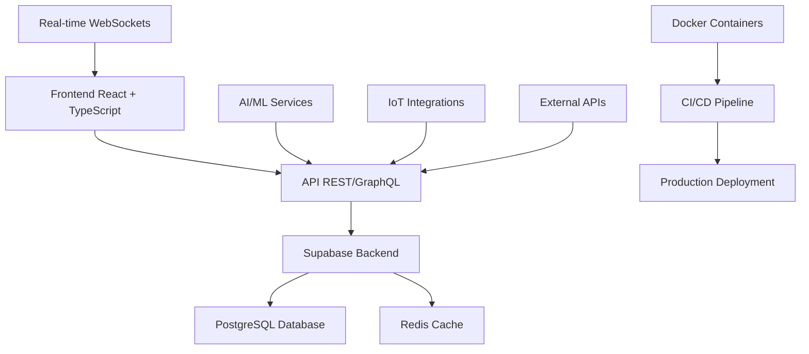

# 🏥 FisioFlow - Sistema de Gestão de Fisioterapia

[](https://github.com/your-org/fisioflow/actions)
[](https://codecov.io/gh/your-org/fisioflow)
[](https://opensource.org/licenses/MIT)
[](https://semver.org)

## 📋 Visão Geral

O **FisioFlow** é um sistema completo de gestão para clínicas de fisioterapia, desenvolvido com tecnologias modernas e focado na experiência do usuário, eficiência operacional e conformidade com regulamentações de saúde.

### 🎯 Principais Funcionalidades

- **👥 Gestão Completa de Pacientes** - Cadastro, histórico médico e acompanhamento
- **📅 Agendamento Inteligente** - Sistema avançado com notificações e lembretes
- **🧑‍⚕️ Portal do Fisioterapeuta** - Ferramentas especializadas para profissionais
- **📊 Dashboard Analítico** - Métricas em tempo real e relatórios detalhados
- **💰 Gestão Financeira** - Controle de receitas, despesas e faturamento
- **🔄 Integração com Dispositivos IoT** - Monitoramento de equipamentos
- **🤖 IA e ML Integrados** - Análises preditivas e recomendações inteligentes
- **🌐 Telemedicina** - Consultas remotas com vídeo 4K
- **🛡️ Segurança Avançada** - Conformidade LGPD/HIPAA e auditoria completa

### 🏗️ Arquitetura do Sistema



## 🚀 Início Rápido

### Pré-requisitos

- **Node.js** 18+ 
- **Docker** & **Docker Compose**
- **PostgreSQL** 15+
- **Redis** 7+

### 💻 Instalação Local

```bash
# 1. Clone o repositório
git clone https://github.com/your-org/fisioflow.git
cd fisioflow

# 2. Instale as dependências
npm install

# 3. Configure as variáveis de ambiente
cp .env.example .env
# Edite o arquivo .env com suas configurações

# 4. Execute com Docker Compose
npm run docker:compose:up

# 5. Acesse a aplicação
# Frontend: http://localhost:5173
# Admin Dashboard: http://localhost:3000
# API Docs: http://localhost:5173/api/docs
```

### 🔧 Configuração Manual

```bash
# Desenvolvimento frontend
npm run frontend:dev

# Desenvolvimento backend  
npm run backend:dev

# Desenvolvimento completo
npm run dev
```

## 🧪 Testes

O FisioFlow possui uma suíte completa de testes automatizados:

### Executar Testes

```bash
# Todos os testes
npm test

# Testes unitários
npm run test:unit

# Testes de integração
npm run test:integration

# Testes E2E
npm run test:e2e

# Cobertura de testes
npm run test:coverage

# Modo watch
npm run test:watch
```

### 📊 Cobertura de Testes

- **Unit Tests**: Componentes individuais e lógica de negócio
- **Integration Tests**: Fluxos completos de autenticação e API
- **E2E Tests**: Jornadas completas do usuário com Puppeteer
- **Performance Tests**: Métricas de performance e carregamento
- **Accessibility Tests**: Conformidade com WCAG 2.1

## 🏗️ Stack Tecnológica

### Frontend
- **React 18** - Interface de usuário moderna
- **TypeScript** - Tipagem estática
- **Tailwind CSS** - Framework CSS utility-first
- **Framer Motion** - Animações fluidas
- **React Query** - Gerenciamento de estado servidor
- **React Hook Form** - Formulários performáticos

### Backend
- **Supabase** - Backend as a Service
- **PostgreSQL** - Banco de dados relacional
- **Redis** - Cache e sessões
- **Node.js/Express** - API REST
- **WebSockets** - Comunicação em tempo real

### DevOps & Deploy
- **Docker** - Containerização
- **GitHub Actions** - CI/CD automatizado  
- **Vercel** - Deploy de produção
- **Prometheus + Grafana** - Monitoramento
- **Sentry** - Error tracking

### Testes & Qualidade
- **Jest** - Framework de testes
- **Testing Library** - Testes de componentes
- **Puppeteer** - Testes E2E
- **ESLint + Prettier** - Code quality
- **Husky** - Git hooks

## 📚 Documentação

### 🎮 Demo Interativa
Experimente todas as funcionalidades: `/demo`

### 📊 Apresentação Executiva  
Visão completa do projeto: `/presentation`

### 📖 Documentação Técnica

- [**Guia de Instalação**](docs/installation.md)
- [**Manual do Usuário**](docs/user-guide.md) 
- [**API Reference**](docs/api-reference.md)
- [**Guia de Contribuição**](docs/contributing.md)
- [**Arquitetura do Sistema**](docs/architecture.md)
- [**Guia de Deploy**](docs/deployment.md)

## 🔧 Scripts Disponíveis

```bash
# Desenvolvimento
npm run dev                    # Executar em modo desenvolvimento
npm run build                 # Build para produção
npm run preview               # Visualizar build local

# Testes
npm test                      # Executar todos os testes  
npm run test:coverage         # Testes com cobertura
npm run test:ci              # Testes para CI/CD

# Code Quality
npm run lint                  # Executar linter
npm run format               # Formatar código
npm run type-check           # Verificar tipos TypeScript

# Docker
npm run docker:build         # Build da imagem Docker
npm run docker:compose:up    # Subir stack completa
npm run docker:compose:down  # Parar stack

# Database
npm run db:seed              # Popular banco com dados de teste
npm run db:backup            # Backup do banco de dados

# Deploy
npm run deploy:production    # Deploy para produção
```

## 🏗️ Estrutura do Projeto

```
src/
├── components/     # Componentes reutilizáveis
│   ├── Layout/     # Componentes de layout
│   ├── Forms/      # Componentes de formulário
│   ├── UI/         # Componentes de interface
│   └── Business/   # Componentes de negócio
├── pages/          # Páginas da aplicação
├── hooks/          # Custom hooks
├── contexts/       # Contextos React
├── stores/         # Gerenciamento de estado
├── lib/            # Bibliotecas e utilitários
├── types/          # Definições de tipos TypeScript
└── test/           # Testes automatizados
    ├── unit/       # Testes unitários
    ├── integration/ # Testes de integração
    └── e2e/        # Testes end-to-end

api/               # Backend APIs (Node.js/Express)
├── routes/        # Rotas da API
├── middleware/    # Middlewares
├── database/      # Configurações do banco
└── utils/         # Utilitários do backend

supabase/          # Configurações e migrações
├── migrations/    # Migrações do banco
└── functions/     # Edge functions

docker/            # Configurações Docker
.github/           # GitHub Actions e templates
docs/              # Documentação técnica
```

## 🌟 Funcionalidades Avançadas

### 🤖 Inteligência Artificial
- Análise preditiva de recuperação de pacientes
- Recomendações personalizadas de exercícios
- Detecção automática de riscos de saúde
- Otimização inteligente de agendamentos

### 🌐 Integrações Externas
- **Laboratórios** - HL7 FHIR, LOINC, SNOMED
- **Planos de Saúde** - Integração com operadoras
- **Pagamentos** - Stripe, PayPal, Adyen, MercadoPago
- **IoT** - Dispositivos médicos e wearables
- **Telemedicina** - Consultas em vídeo 4K

### 🛡️ Segurança e Compliance
- **Criptografia ponta a ponta** para dados sensíveis
- **Conformidade LGPD/HIPAA** completa
- **Auditoria detalhada** de todas as ações
- **Backup automatizado** e disaster recovery
- **Controle de acesso granular** por perfis

### 📊 Analytics e Relatórios
- Dashboard executivo em tempo real
- Relatórios personalizáveis e automatizados
- Métricas de performance e KPIs
- Análises financeiras detalhadas
- Exportação para múltiplos formatos

## 🤝 Contribuindo

Contribuições são bem-vindas! Por favor, leia nosso [Guia de Contribuição](CONTRIBUTING.md).

### 📋 Como Contribuir

1. Fork o projeto
2. Crie uma branch para sua feature (`git checkout -b feature/AmazingFeature`)
3. Commit suas mudanças (`git commit -m 'Add some AmazingFeature'`)
4. Push para a branch (`git push origin feature/AmazingFeature`)
5. Abra um Pull Request

## 📄 Licença

Este projeto está licenciado sob a Licença MIT - veja o arquivo [LICENSE](LICENSE) para detalhes.

## 👥 Equipe

- **Tech Lead** - Arquitetura e desenvolvimento full-stack
- **UX/UI Designer** - Interface e experiência do usuário  
- **DevOps Engineer** - Infraestrutura e deployment
- **QA Engineer** - Qualidade e testes automatizados
- **Product Owner** - Produto e requisitos de negócio

## 📞 Suporte

- **Email**: suporte@fisioflow.com
- **Discord**: [FisioFlow Community](https://discord.gg/fisioflow)
- **Documentação**: [docs.fisioflow.com](https://docs.fisioflow.com)
- **Issues**: [GitHub Issues](https://github.com/your-org/fisioflow/issues)

## 🌐 Links Úteis

- **🎮 Demo Interativa**: [fisioflow.com/demo](https://fisioflow.com/demo)
- **📊 Dashboard Analytics**: [analytics.fisioflow.com](https://analytics.fisioflow.com)  
- **🚀 Status Page**: [status.fisioflow.com](https://status.fisioflow.com)
- **📚 Documentação**: [docs.fisioflow.com](https://docs.fisioflow.com)

---

<div align="center">

**Desenvolvido com ❤️ pela equipe FisioFlow**

[](https://github.com/your-org/fisioflow/stargazers)
[](https://github.com/your-org/fisioflow/network)
[](https://github.com/your-org/fisioflow/issues)

</div>
